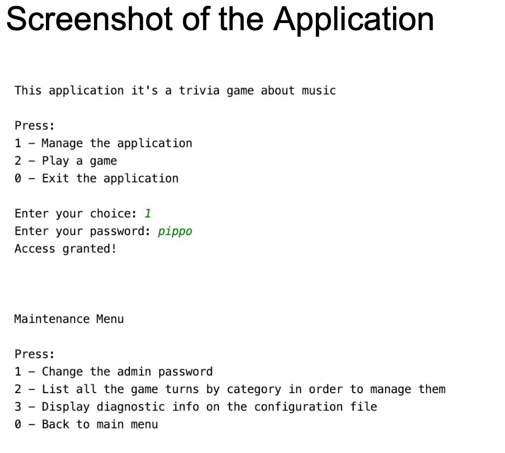

# java-music-trivia-command-line-app

A command line app music trivia written in java.

Features
- The Trivia application will present a menu, where the user can identify himself by entering the username, or the user id before having access to the Trivia game.
- Trivia game is composed of a minimum two different trivia category games, each trivia game should have a minimum of 5 questions with their answers.
- Enumerate the possible answers for each question, and the user can enter the number or the letter option to choose the appropriate answer.
- Save the username and answers and count the good answers for statistical usage. Display at the end of the game the information saved.
- Only the manager has the option to manage the Trivia application, using a special code that is to give access to the administrator to add/remove/modify questions and/or the answers.

